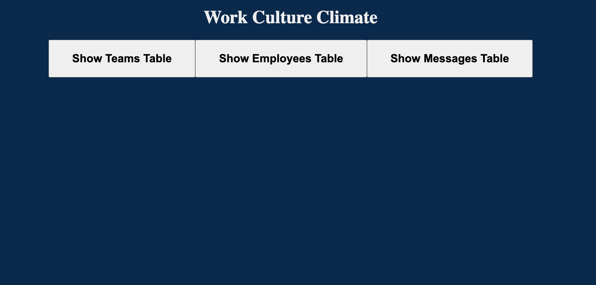
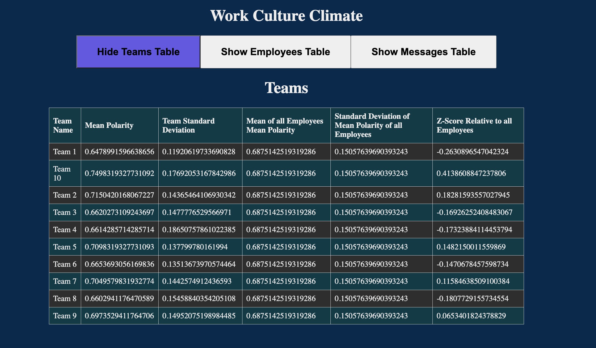
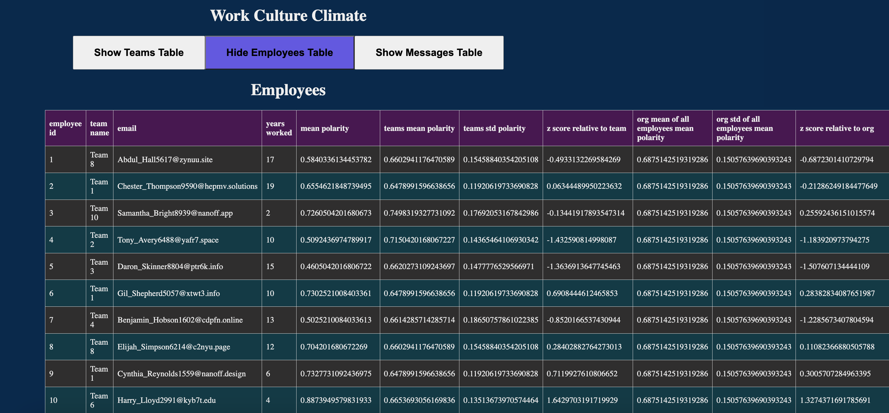
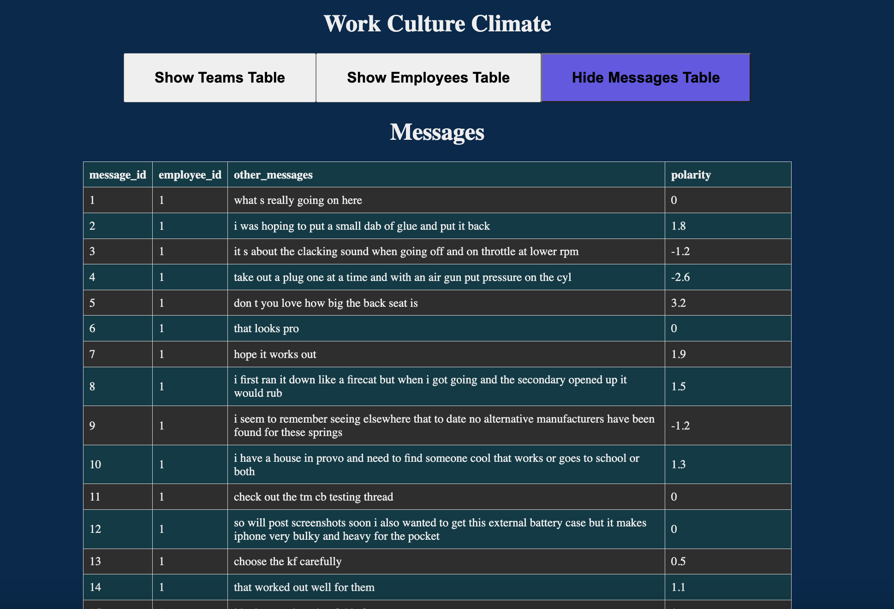
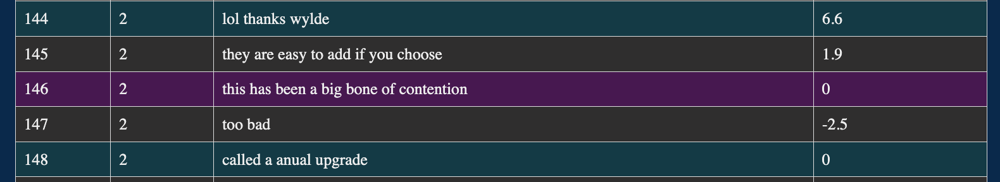
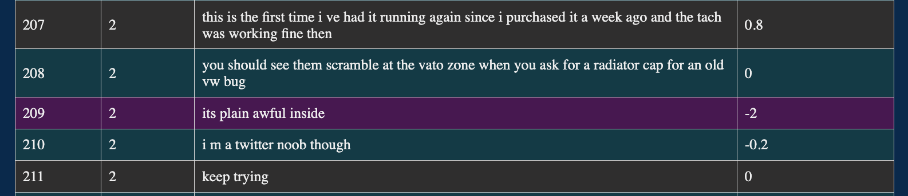

# Work Culture Climate App

This Full Stack Web App shows the sentiment analysis results of employees' messages.

 I used messages from [Michigan Tech Mobile Text Dataset](https://digitalcommons.mtu.edu/mobiletext/) to build a sentiment analysis model to calculate the “compound score” for every message sent by employees to gauge positivity in the workplace using the VADER sentiment analyzer module.

I designed and developed a relational database using MySQL Workbench to store companies and the sentiment score of their employees’ messages to evaluate the healthiness of its work culture.

The Web App was built using NodeJS and Express for the Backend APIs and VueJS for the Frontend.

## Screenshots of the Web App

### Main Page

### Teams Data

### Employees Data

### Messages with Polarity Scores

#### Interesting Messages and their Polarity Scores

